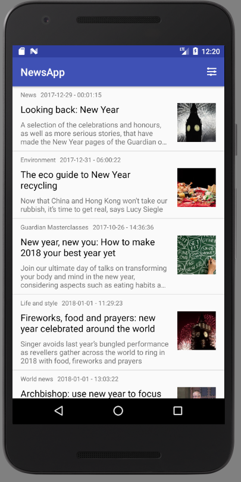
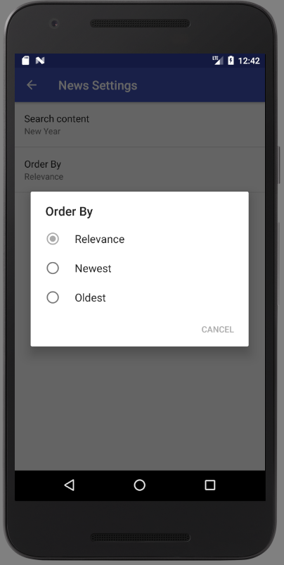
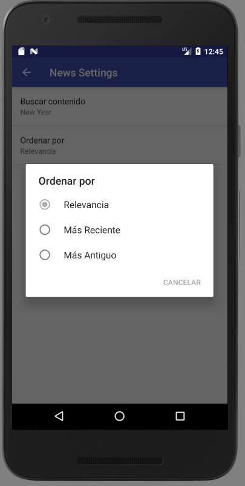

# News App

This app uses [The Guardian Open Plataform](http://open-platform.theguardian.com/) API to show news related to a selected topic,
returning 10 results

# Features

- Implements `Loader`, `ListView` and`SharedPreferences`
- Input field to enter search topic.
- Allows to organize results by relevance or date.
- Each results redirects to the official page to read the full news.

# Screenshots

# News App

Esta app implementa la API [The Guardian Open Plataform](http://open-platform.theguardian.com/) para realizar una consulta sobre noticias 
relacionadas con un tema y retornar 10 resultados.

# Características

- Implementa `Loader`, `ListView` y `SharedPreferences`
- Campo de entrada para ingresar el tema a consultar
- Permite organizar resultados por relevancia o antigüedad.
- Cada resultado redirecciona a la página oficial para leer la noticia completa.

# Screenshots

